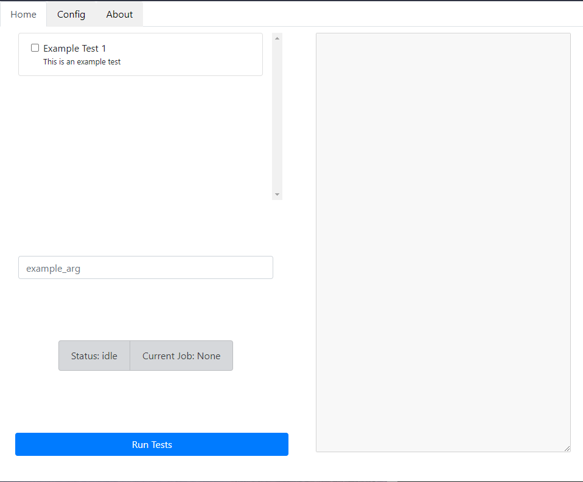

# GUIfy

---

Simplest form of GUI for automation scripts.

Made with eel as python backend and react used as frontend.

main branch has built&optimized react app

dev branch has development version of react app

## Main tab



## Config tab


## How to use

---

### Quick start

```bash
pip install guify
```

Look inside [this example](docs/example.py) or follow the instructions below:

```py
# main.py
import GUIfy from guify

app = GUIfy(app_name='GUIfy') # default app_name is 'GUIfy'

@app.register(name='Test 1', priority=0, description='This is a test')
def test_1(example_arg):
   app.monitor.clear_text()
   app.monitor.set_text('This is a test\n')
   app.monitor.append_text('This is a test2\n')
   result = app.prompt_user('This is a prompt') # True if user clicked OK, False if user clicked Cancel
   foo = app.config.get('example','foo') # == bar


app.run()

```

---

### Monitor object

app.monitor is the monitor object representing the preview window on right hand side of the GUI,

- set_text(text: str) -> None // will set the text in the monitor to whatever passed in "text" argument
- append_text(text: str) -> None // will append the next to the monitor
- clear_text(text: str) -> None // will clear all text in the monitor

---

## Config tab

"app.config" is an object representing the config tab.
All configurations are stored in config.ini.

### self.config methods:

- save() // Save config to config.ini
- load() // Load config from config.ini
- get_section() // load() and return an entire section as a dictionary
- get(section, attribute) // load() and get value of attribute in section
- set(section, attribute, value) // load() and set value of attribute in section and then save().

### config file:

```ini
[example]
foo = bar
```

```py
get_secion('example') -> {'foo': 'bar'}
get('example', 'foo') -> 'bar'
```

---

## Settings

in settings.ini you can change the following settings:

- reports_dir - the directory where the reports will be saved
- report_name_prefix - can be one of the variables passed in to your run() functions, uses this variable name as identification for reports

---

## Building

To build an executable in dist folder, run the following:

`npm run build`
